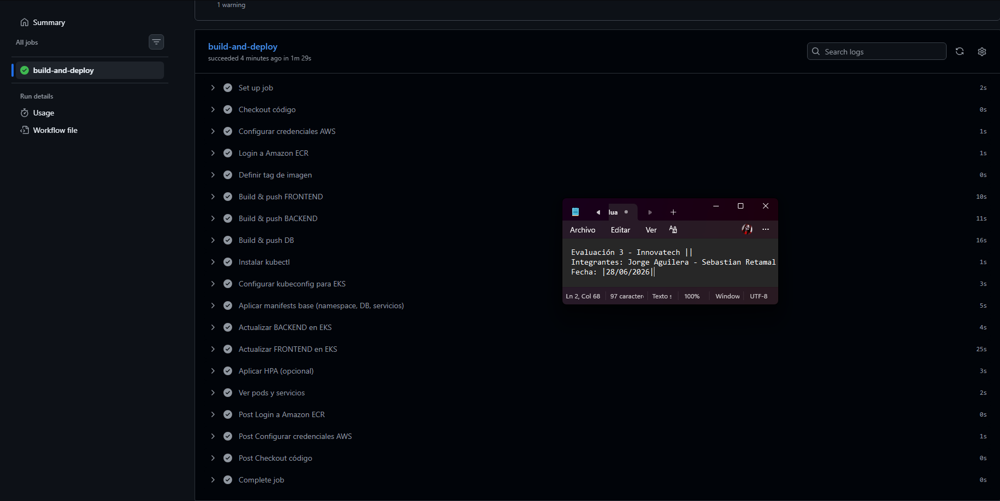
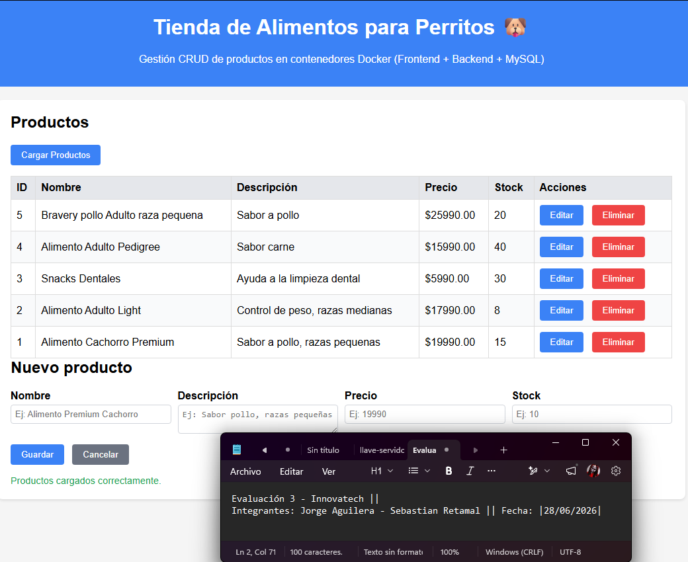
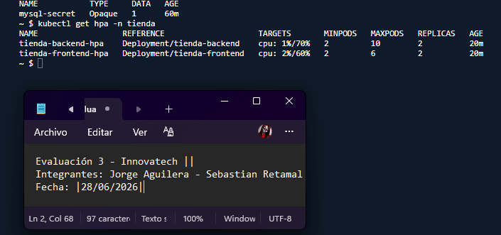
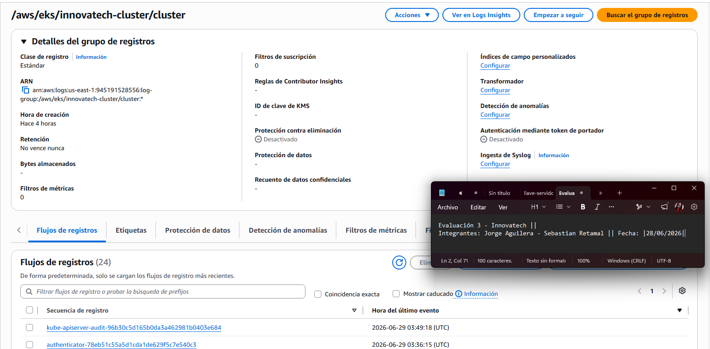
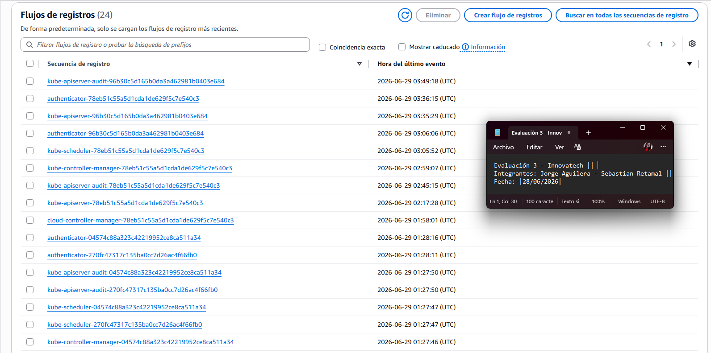

# Proyecto Tienda de Alimentos para Perritos - Innovatech

Este proyecto forma parte de la Evaluación Parcial N°3 de la asignatura Introducción a Herramientas DevOps. Implementa una arquitectura de microservicios desplegada automáticamente en AWS EKS.

## Arquitectura y Funcionamiento
El sistema consta de tres componentes principales:
- **Frontend**: Interfaz de usuario para la gestión de productos.
- **Backend**: API que procesa las solicitudes y gestiona la lógica de negocio.
- **Database (MySQL)**: Persistencia de datos.

La infraestructura está orquestada en **AWS EKS** (Kubernetes), con escalado automático (**HPA**) basado en métricas de CPU y despliegue automatizado mediante **GitHub Actions**.

## Pipeline CI/CD (Automatización)
El pipeline en GitHub Actions (`.github/workflows/deploy-eks.yml`) automatiza el siguiente flujo:
1. **Build**: Construcción de imágenes Docker.
2. **Push**: Envío de imágenes a Amazon ECR.
3. **Deploy**: Despliegue de manifiestos en el clúster EKS (`innovatech-cluster`).

## Cómo utilizar el proyecto
Al estar 100% automatizado, el proyecto no requiere despliegue manual. 
1. Cualquier push a la rama `main` disparará el pipeline de GitHub Actions.
2. Una vez finalizado el pipeline, AWS provisionará un Balanceador de Carga (ALB).
3. Para usar la aplicación, simplemente se debe ingresar a la URL pública entregada por el Load Balancer en el navegador, donde se podrá visualizar la interfaz web y hacer pruebas CRUD (Crear, Leer, Actualizar y Eliminar productos).

*Nota: Para que el pipeline funcione en un entorno nuevo, se deben configurar los Secrets de AWS (`AWS_ACCESS_KEY_ID`, `AWS_SECRET_ACCESS_KEY`, `AWS_SESSION_TOKEN`) en el repositorio.*

## Evidencias Técnicas
- **Captura Pipeline Exitoso:** 
- **Captura Aplicación Funcionando:** 
- **Captura HPA y Seguridad:** 
- **Captura Grupo de Logs CloudWatch:** 
- **Captura Detalle Flujo de Logs:** 

## Integrantes
- Jorge Aguilera
- Sebastian Retamal
